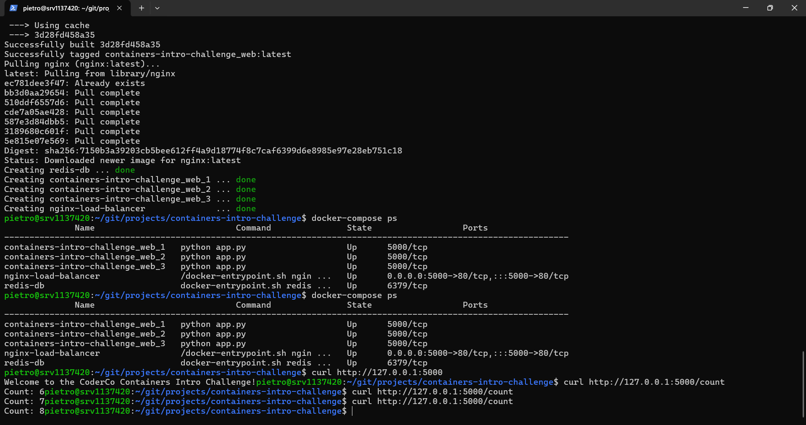
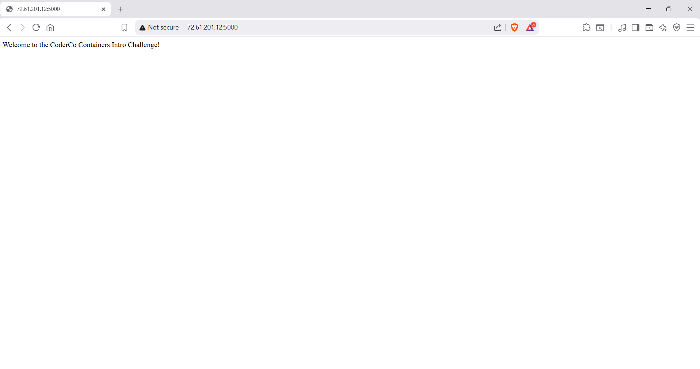
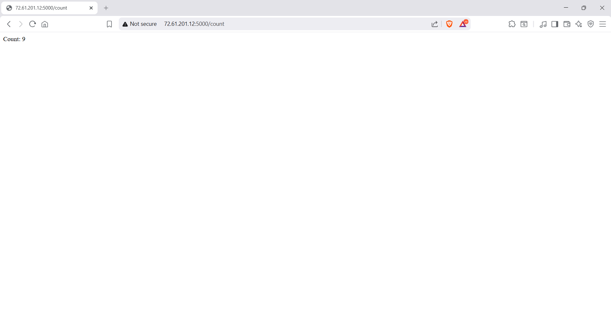

# Multi-Container Flask + Redis App (Docker)

## Overview

This project is a realistic example of a multi-container application using Docker and Docker Compose.

The idea was to build something that is:

* scalable
* stateful where needed
* structured like a real-world setup

The application tracks how many times the `/count` endpoint is visited, using Redis to persist data across multiple containers.

---

## What This Project Demonstrates

This project shows:

* Running multiple containers together
* Separation of concerns (app vs database vs load balancer)
* Shared state across multiple app instances
* Load balancing using NGINX
* Persistence using Docker volumes

---

## Architecture (Simple View)

Client → NGINX → Flask (multiple containers) → Redis

### How it works:

* The client sends a request to the app
* NGINX receives the request and forwards it to one of the Flask containers
* Flask processes the request
* Redis stores and updates the counter
* The response is sent back to the client

---

## Services Breakdown

### Flask App (web)

* Handles HTTP requests
* Exposes:

  * `/` → basic message
  * `/count` → increments and returns visit count
* Runs in multiple containers (scaled using Docker Compose)

---

### Redis

* Used to store the counter (`visits`)
* Ensures all Flask containers share the same data
* Data is persisted using a Docker volume

This is important because:
Without Redis, each container would have its own separate counter

---

### NGINX (Load Balancer)

* Acts as a reverse proxy
* Distributes traffic across multiple Flask containers
* Allows scaling without changing how the client connects

---

## Key Concepts Explained

### Stateless vs Stateful

* Flask containers are stateless → they don’t store data
* Redis is stateful → it stores the counter

This is how real systems are designed

---

### Scaling

The app is scaled using:

```bash
docker-compose up -d --build --scale web=3
```

This creates multiple Flask containers:

* web_1
* web_2
* web_3

NGINX distributes traffic between them

---

### Persistence

Redis uses a Docker volume:

* Data survives container restarts
* The counter continues even after `docker-compose down`

---

### Environment Variables

Flask connects to Redis using:

* REDIS_HOST
* REDIS_PORT

This avoids hardcoding values and makes the app more flexible

---

## Project Structure

```
.
├── app.py
├── Dockerfile
├── docker-compose.yml
├── nginx.conf
├── requirements.txt
├── .gitignore
└── screenshots/
```

---

## Running the Application

```bash
docker-compose up -d --build --scale web=3
```


Access the application

Home page:
http://72.61.201.12:5000

Counter endpoint:
http://72.61.201.12:5000/count

---

## Screenshots

### Containers Running



### Home Page



### Counter Endpoint



---

## Example Output

* Count: 8
* Count: 9
* Count: 10

---

## Key Learnings

* How multi-container applications work
* How services communicate inside Docker networks
* Why separating state (Redis) from app (Flask) matters
* How to scale applications horizontally
* How load balancing works in practice
* How to persist data using Docker volumes

---

## Reflection

This project helped me understand how real systems are structured.

Instead of running everything in one container, each component has a clear role:

* Flask handles logic
* Redis handles data
* NGINX handles traffic

This separation makes the system more scalable and easier to manage.

---

## Future Improvements

* Add a frontend UI
* Add authentication
* Deploy with HTTPS
* Move to AWS (EC2 / ECS)
* Add monitoring (Prometheus / Grafana)

